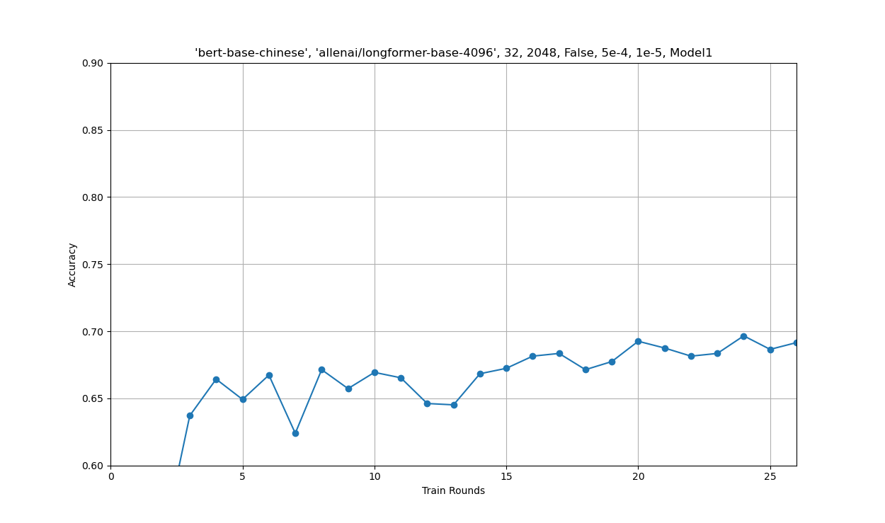
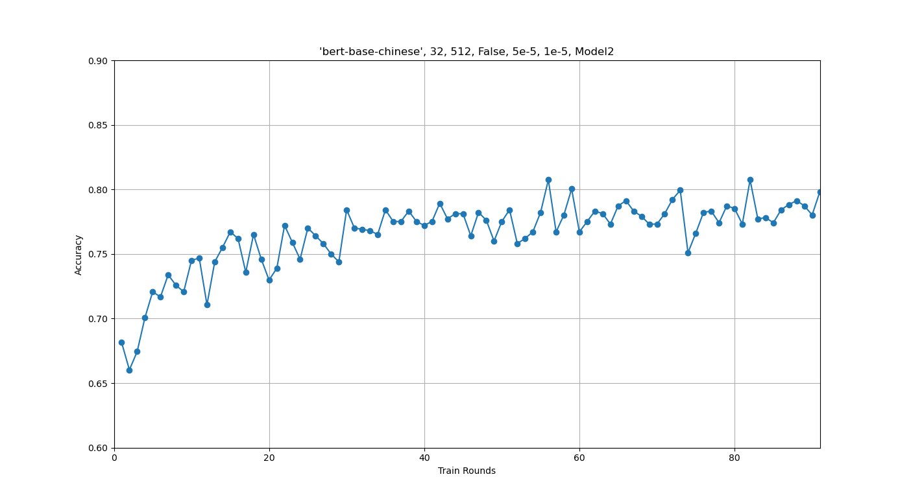
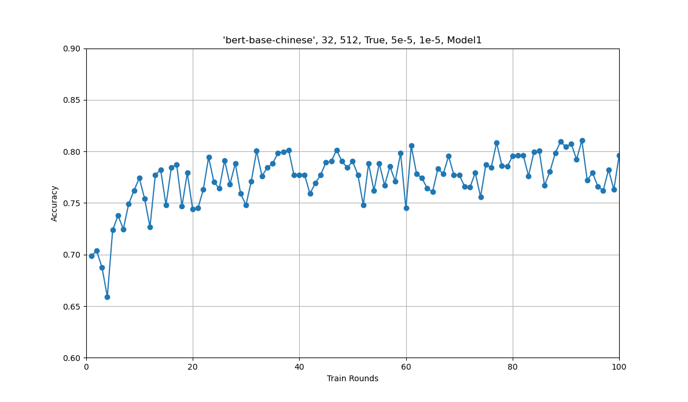
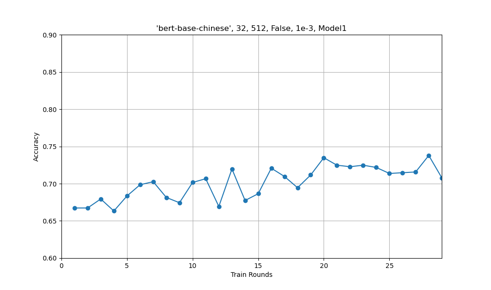
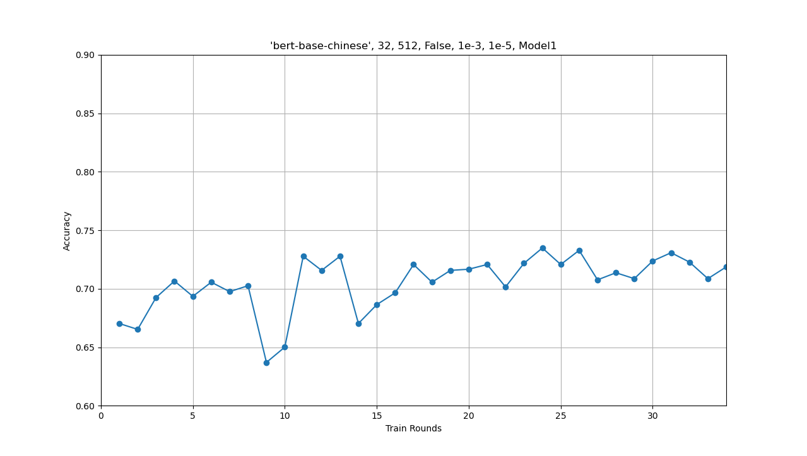
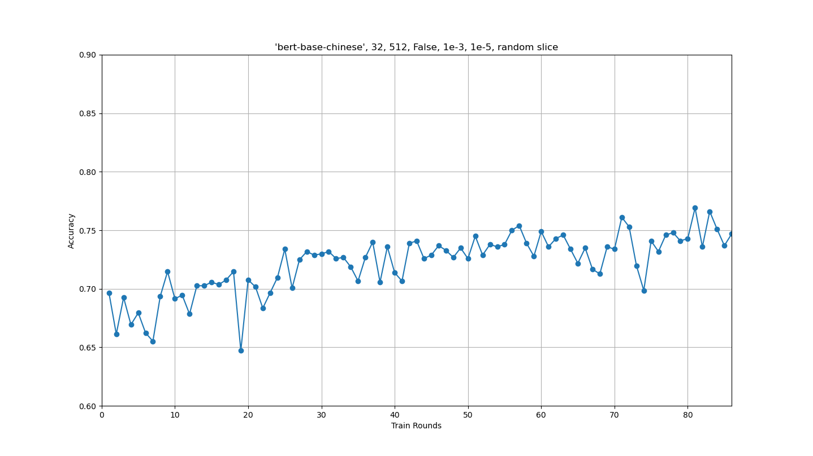

# PPCA_codemate

本项目分为两部分：爬虫部分实现了对一些网站数据的爬取；分类器部分实现了对爬取数据质量筛选的分类器的训练。

## 爬虫

爬虫学习&编写记录：[https://hastin-blog.cn/post/python%E7%88%AC%E8%99%AB%E5%AE%9E%E5%BD%95/](https://hastin-blog.cn/post/python%E7%88%AC%E8%99%AB%E5%AE%9E%E5%BD%95/)

爬虫进阶学习记录：[https://hastin-blog.cn/post/python%E7%88%AC%E8%99%AB%E8%BF%9B%E9%98%B6/](https://hastin-blog.cn/post/python%E7%88%AC%E8%99%AB%E8%BF%9B%E9%98%B6/)

本项目实现了对 CSDN 问答，Wikipedia，stackoverflow 三个网站的数据爬取。

所有爬虫均实现了成功爬取链接的记录，存储在对应的 `success.out` 中，在爬取时只爬取未成功的链接。即使程序运行中断，再次启动程序也能实现无重复无遗漏的爬取。

CSDN 精华 和 stackoverflow 的爬虫实现了对代码块的识别，爬取的代码块会用 ` ```\n ` 包裹起来。

爬取的内容为 `算法分析` 相关，搜索的关键词列表为：

```
"书籍和算法",
"Fibonacci数列",
"大O表示法",
"算法与数字",
"基本算术",
"模运算",
"素性测试",
"密码学",
"通用散列",
"分治算法",
"乘法",
"递归关系",
"归并排序",
"中位数",
"矩阵乘法",
"快速傅里叶变换",
"图的分解",
"图的深度优先搜索",
"图的强连通分量",
"图中的路径",
"广度优先搜索",
"边的长度",
"Dijkstra算法",
"优先队列实现",
"负权边的最短路径",
"有向无环图的最短路径",
"贪婪算法",
"最小生成树",
"哈夫曼编码",
"Horn公式",
"集合覆盖",
"动态规划",
"有向无环图的最短路径（重温）",
"最长递增子序列",
"编辑距离",
"背包问题",
"矩阵链乘法",
"最短路径",
"树中的独立集",
"线性规划和规约",
"线性规划简介",
"网络中的流",
"二分匹配",
"对偶性",
"零和博弈",
"单纯形算法",
"电路评估",
"NP完全问题",
"搜索问题",
"规约",
"应对NP完全问题",
"智能穷举搜索",
"近似算法"
```

以下是各网站的爬虫介绍。

### CSDN

CSDN 网站分为两部分：
- 搜索关键字后爬取对应的数据
- 在[CSDN问答的精华版块](https://ask.csdn.net/channel/1005?rewardType&stateType=0&sortBy=1&quick=6&essenceType=1&tagName=essence)爬取所有数据。

#### 第一部分

为保证数据形式和质量，在 CSDN 首页点击问答并勾选已采纳，再爬取获得的数据。

相关代码在 [`CSDN_1.py`](https://github.com/zsq259/PPCA_codemate/blob/main/crawler/CSDN/CSDN_1.py) 中。

中通过 `asyncio` 库，利用协程实现了并行爬虫。并且通过 `BeautifulSoup` 去除了 html 代码。

由于没有用模拟浏览器的方式，需要在搜索关键词后的页面爬取答案，再到问题详情页爬取问题（问题详情页的答案是动态渲染的）。

#### 第二部分

首先，需要进入 [https://ask.csdn.net/channel/1005?rewardType&stateType=0&sortBy=1&quick=6&essenceType=1&tagName=essence](https://ask.csdn.net/channel/1005?rewardType&stateType=0&sortBy=1&quick=6&essenceType=1&tagName=essence) 页面获得所有具体问答的链接。这一步骤在 [`CSDN.py`](https://github.com/zsq259/PPCA_codemate/blob/main/crawler/CSDN/CSDN.py) 中解决。代码主要利用 `playwright` ，模拟了鼠标滚轮下滑来获取所有链接。

获取完所有链接后，再进入到具体的问答页面获得数据。根据第一部分的经验，已知答案是动态渲染的，所以采取了利用 `playwright` 模拟浏览器的方式爬取。在此基础上，[`CSDN_2.py`](https://github.com/zsq259/PPCA_codemate/blob/main/crawler/CSDN/CSDN_2.py) 利用 `asyncio` 实现了并行爬虫，但由于同时爬取的链接太多会导致崩溃。而 [`CSDN_3.py`](https://github.com/zsq259/PPCA_codemate/blob/main/crawler/CSDN/CSDN_3.py) 利用 `threading` 采取多线程爬虫，从而可以限制线程数量，但也需注意变量锁的设置。

此部分有一处细节在于，模拟浏览器进入页面后，页面并非立刻加载完成，所以需要使用 `time.sleep()` 等待一段时间，否则会无法获取信息。

### Wikipedia

具体的过程和需要注意的细节已经写在了 [blog 中](https://hastin-blog.cn/post/python%E7%88%AC%E8%99%AB%E5%AE%9E%E5%BD%95/)。

在 [`wikipedia.py`](https://github.com/zsq259/PPCA_codemate/blob/main/crawler/wikipedia/wikipedia.py) 中，实现了：

- 在搜索框中搜索关键词。

- 若不能直接跳转具体词条页面，则选取搜索结果的第一条跳转。

- 若有目录，则按照目录显示的各级标题作为所有问题（有些标题并未显示在目录中）；否则直接将所有标题作为问题。

- 将所有问题（各级标题）下对应的文字进行爬取，并拼接为答案组成问答对。

- 每个问题将会爬取当前标题与下一个同级的标题或页面结尾之间的所有文字。

### stackoverflow

与 CSDN 没有太大区别，但是有人机验证和请求太多封 ip 的反爬虫机制。

人工进行人机验证，在接下来的 5min 内网站不会跳转人机验证页面，在这段时间利用爬虫爬取。

[`src.py`](crawler/stackoverflow/src.py) 中实现了在搜索关键词后自动翻页并爬取所有通往具体问答页面的链接。
[`so_spider`](crawler/stackoverflow/so_spider) 文件夹下则是利用 `scrapy` 框架，对所有具体问答页面进行爬取。

如果需要提高爬虫速度的话，需要建立 ip 池解决请求太多被封 ip 的问题。但因为没有足够多的 ip 所以没能实现。

## 分类器

前期学习记录：[https://hastin-blog.cn/post/%E6%96%87%E6%9C%AC%E7%9A%84%E5%90%91%E9%87%8F%E5%8C%96%E5%92%8C%E5%88%86%E7%B1%BB%E5%99%A8%E7%9A%84%E8%AE%AD%E7%BB%83/](https://hastin-blog.cn/post/%E6%96%87%E6%9C%AC%E7%9A%84%E5%90%91%E9%87%8F%E5%8C%96%E5%92%8C%E5%88%86%E7%B1%BB%E5%99%A8%E7%9A%84%E8%AE%AD%E7%BB%83/)

总体分为两部分，首先将爬取的数据以问题+答案的形式拼成一句话，将其向量化以能被机器接受。再用已经标注好（标记一个问答的质量好坏）的数据集训练模型，并让模型对给出的测试集中的问答进行质量的分类预测。

在前期，使用 `sklearn` 提供的相关库，主要用机器学习进行训练，后期则是下载并使用 `huggingface` 上的预训练模型并手动构建神经网络。

### 前期

使用 `jieba` 进行分词。

采取了若干种不同的模型组合尝试。

向量化模型的选择：

- `TfidfVectorizer`

- `CountVectorizer`

- `Word2Vec`

分类器的算法实现的选择：

- `RandomForestClassifier`（随机森林）

- `MultinomialNB`（多项式朴素贝叶斯）

- `ComplementNB`（补充朴素贝叶斯）

在 [`sklearn_test.py`](https://github.com/zsq259/PPCA_codemate/blob/main/classifier/sklearn_test.py) 中实现了传入 向量化 和 训练模型 的对象即可运行的函数封装，并通过多进程实现同时运行多种模型和参数组合。

由于 `Word2Vec` 使用的对象接口特殊, 所以 [`word2vec_RF.py`](https://github.com/zsq259/PPCA_codemate/blob/main/classifier/word2vec_RF.py) 实现了 `Word2Vec` 与 `RandomForestClassifier` 的组合。

下表显示了训练数据：

| 数据                                 | 模型                                                         | 训练集预测准确率 | 测试集预测准确率         |
| ------------------------------------ | ------------------------------------------------------------ | ------------------------------------ | ------------------ |
| basic                                | TfidfVectorizer(), RandomForestClassifier()                 | 0.9947319491788038 | 0.8345724907063197 |
| basic | TfidfVectorizer(), RandomForestClassifier(n_estimators=155, random_state=43) | 0.9947319491788038 | 0.8392193308550185 |
| basic | CountVectorizer(), MultinomialNB(alpha = 0.1) | 0.8564197913438695 | 0.7379182156133829 |
| basic | CountVectorizer(), ComplementNB(alpha = 0.1) | 0.8562132011155872 | 0.7379182156133829 |
| basic | Word2Vec(lines, vector_size = 20, window = 5 , min_count = 3, epochs=7, negative=10, sg=1), RandomForestClassifier(n_estimators = 155, random_state = 43) | 0.9947319491788038 | 0.7964684014869888 |
| basic+CSDN精华                       | TfidfVectorizer(), RandomForestClassifier()                 | 0.9957112801424178 | 0.8631732168850073 |
| basic+CSDN精华                       | TfidfVectorizer(), RandomForestClassifier(n_estimators=155, random_state=43) | 0.9957112801424178 | 0.8653566229985444 |
| basic+CSDN精华 | CountVectorizer(), MultinomialNB(alpha = 0.1) | 0.8528078977180774 | 0.7561863173216885 |
| basic+CSDN精华 | CountVectorizer(), ComplementNB(alpha = 0.1) | 0.8540216863570157 | 0.754730713245997 |
| basic+CSDN精华 | Word2Vec(lines, vector_size = 20, window = 5 , min_count = 3, epochs=7, negative=10, sg=1), RandomForestClassifier(n_estimators = 155, random_state = 43) | 0.9957112801424178 | 0.8377001455604076 |
| basic+CSDN精华（代码用 ```\n 包围）  | TfidfVectorizer(), RandomForestClassifier()                 | 0.9957112801424178 | 0.8602620087336245 |
| basic+CSDN精华（代码用 ```\n 包围） | TfidfVectorizer(), RandomForestClassifier(n_estimators=155, random_state=43) | 0.9957112801424178 | 0.8609898107714702 |
| basic+CSDN精华（代码用 ```\n 包围） | CountVectorizer(), MultinomialNB(alpha = 0.1) | 0.8510276743809678 | 0.74745269286754 |
| basic+CSDN精华（代码用 ```\n 包围） | CountVectorizer(), ComplementNB(alpha = 0.1) | 0.853050655445865 | 0.74745269286754 |
| basic+CSDN精华（代码用 ```\n 包围） | Word2Vec(lines, vector_size = 20, window = 5 , min_count = 3, epochs=7, negative=10, sg=1), RandomForestClassifier(n_estimators = 155, random_state = 43) | 0.9957921993850137 | 0.8304221251819505 |
| basic+CSDN精华（代码用 [code] 包围） | TfidfVectorizer(), RandomForestClassifier()               | 0.9957112801424178 | 0.8566229985443959 |
| basic+CSDN精华（代码用 [code] 包围） | TfidfVectorizer(), RandomForestClassifier(n_estimators=155, random_state=43) | 0.9957112801424178 | 0.8609898107714702 |
| basic+CSDN精华（代码用 [code] 包围） | CountVectorizer(), MultinomialNB(alpha = 0.1) | 0.8510276743809678 | 0.74745269286754 |
| basic+CSDN精华（代码用 [code] 包围） | CountVectorizer(), ComplementNB(alpha = 0.1) | 0.853050655445865 | 0.74745269286754 |
| basic+CSDN精华（代码用 [code] 包围） | Word2Vec(lines, vector_size = 20, window = 5 , min_count = 3, epochs=7, negative=10, sg=1), RandomForestClassifier(n_estimators = 155, random_state = 43) | 0.9957921993850137 | 0.8384279475982532 |

其中 `数据` 一栏的 `basic` 代表下发的已经标记好的之前爬取的 CSDN 和 Wikipedia 的问答。而 CSDN精华则默认为高质量。

可以看出，TfidfVectorizer() 与 RandomForestClassifier() 的组合效果是最好的，而朴素贝叶斯的组合则表现最差。。这或许与我们分类的问答形式有关。所以后续的进一步调参将只对于 TfidfVectorizer() 与 RandomForestClassifier() 进行。

同时可以发现，在加入 CSDN 精华后，准确率上升了不少。但是代码块是否被包围似乎对最终的准确率影响不大。

经过进一步调整 `RandomForestClassifier()` 参数后的数据：

| 编号 | 数据           | 模型                                                         | 训练集预测准确率   | 测试集预测准确率   |
| ---- | -------------- | ------------------------------------------------------------ | ------------------ | ------------------ |
| 21   | basic+CSDN精华 | TfidfVectorizer(), RandomForestClassifier()                  | 0.9957112801424178 | 0.8602620087336245 |
| 22   | basic+CSDN精华 | TfidfVectorizer(), RandomForestClassifier(n_estimators=55)   | 0.9956303608998219 | 0.858806404657933  |
| 23   | basic+CSDN精华 | TfidfVectorizer(), RandomForestClassifier(n_estimators=200)  | 0.9957112801424178 | 0.8573508005822417 |
| 24   | basic+CSDN精华 | TfidfVectorizer(), RandomForestClassifier(n_estimators=155, random_state=43) | 0.9957112801424178 | 0.8609898107714702 |
| 25   | basic+CSDN精华 | TfidfVectorizer(), RandomForestClassifier(n_estimators=155, random_state=47) | 0.9957112801424178 | 0.8580786026200873 |
| 26   | basic+CSDN精华 | TfidfVectorizer(), RandomForestClassifier(n_estimators=155, random_state=97) | 0.9957112801424178 | 0.8566229985443959 |
| 27   | basic+CSDN精华 | TfidfVectorizer(), RandomForestClassifier(n_estimators=155, random_state=127) | 0.9957112801424178 | 0.8580786026200873 |
| 28   | basic+CSDN精华 | TfidfVectorizer(), RandomForestClassifier(n_estimators=155, random_state=23) | 0.9957112801424178 | 0.8624454148471615 |
| 29   | basic+CSDN精华 | TfidfVectorizer(), RandomForestClassifier(n_estimators=155, random_state=59) | 0.9957112801424178 | 0.8573508005822417 |
| 30   | basic+CSDN精华 | TfidfVectorizer(), RandomForestClassifier(n_estimators=155, random_state=71) | 0.9957112801424178 | 0.8624454148471615 |

可以发现随机森林中决策树的数量以及随机数的选取对最终的准确率影响并不大。

之后再尝试调整 `TfidfVectorizer()` 的参数：

| 编号 | 数据           | 模型                                                         | 训练集预测准确率   | 测试集预测准确率   |
| ---- | -------------- | ------------------------------------------------------------ | ------------------ | ------------------ |
| 31   | basic+CSDN精华 | TfidfVectorizer(max_df=0.6), RandomForestClassifier(n_estimators=155, random_state=71) | 0.9957112801424178 | 0.8609898107714702 |
| 32   | basic+CSDN精华 | TfidfVectorizer(token_pattern=r"(?u)\b\w+\b"), RandomForestClassifier(n_estimators=155, random_state=71) | 0.9957112801424178 | 0.8602620087336245 |
| 33   | basic+CSDN精华 | TfidfVectorizer(stop_words = stopwords), RandomForestClassifier(n_estimators=155, random_state=71) | 0.9957112801424178 | 0.8580786026200873 |
| 34   | basic+CSDN精华 | TfidfVectorizer(max_df=0.6, token_pattern=r"(?u)\b\w+\b"), RandomForestClassifier(n_estimators=155, random_state=71) | 0.9957112801424178 | 0.863901018922853  |
| 35   | basic+CSDN精华 | TfidfVectorizer(max_df=0.6, stop_words = stopwords), RandomForestClassifier(n_estimators=155, random_state=71) | 0.9957112801424178 | 0.8631732168850073 |
| 36   | basic+CSDN精华 | TfidfVectorizer(token_pattern=r"(?u)\b\w+\b", stop_words = stopwords), RandomForestClassifier(n_estimators=155, random_state=71) | 0.9957112801424178 | 0.8631732168850073 |
| 37   | basic+CSDN精华 | TfidfVectorizer(max_df=0.6, token_pattern=r"(?u)\b\w+\b", stop_words = stopwords), RandomForestClassifier(n_estimators=155, random_state=71) | 0.9957112801424178 | 0.8668122270742358 |

以下是停用词列表：

```
"的", "了", "和", "呢", "啊", "哦",
"就", "而", "或", "及", "与", "等",
"这", "那", "之", "只", "个",
"是", "在", "很", "有", "我", "你",
"他", "她", "它", "我们", "你们", "他们",
"自己", "什么", "怎么", "为什么", "因为", "所以",
"如何", "可以", "是否", "是否能够", "能否",
"是否可以", "能不能", "可以吗", "能不能够", "能否给出",
"请问", "请教", "请告知", "请帮忙", "请解释",
"请说明", "请指导", "请提供", "请提醒", "请确认",
"请回答", "请说一下", "请描述", "请列举", "请比较",
"请分析", "请解决", "请评价", "请推荐", "请指出",
"请给出", "请阐述", "请讨论", "请注意", "请考虑",
"谢谢","求求","高手","感激不尽","请"
```

可以发现，对 `TfidfVectorizer()` 的参数加以限制，还是能提升预测的准确率的。并且组合参数限制能带来更大的提升。但总体来说，提升幅度也并不是很大。

### 后期

主要使用 `huggingface` 中的 bert 预训练模型，构建神经网络，进行深度学习。

主要对于以下参数进行调整（已经尝试过的）。

对于每组数据一般进行 100 轮迭代（将训练数据反复喂给模型），但由于算力问题，以及云端平台的不稳定性，有部分数据的轮数少一些，而且由于前期轮次的效果不是很好，所以就没有重新测试。

- 预训练模型的选择

  - `bert-base-chinese`
  - `algolet/bert-large-chinese`
  - `allenai/longformer-base-4096`

- 下游模型中的神经网络层

  - `Model1`由四个全连接层组成。每个全连接层都由线性层和批量归一化层组成，并使用ReLU激活函数进行非线性变换。

    ```
    class Model1(torch.nn.Module):
        def __init__(self):
            super().__init__()
            self.fc1 = torch.nn.Sequential( torch.nn.Linear(768, 1600), torch.nn.BatchNorm1d(1600), torch.nn.ReLU(True))
            self.fc2 = torch.nn.Sequential( torch.nn.Linear(1600, 800), torch.nn.BatchNorm1d(800), torch.nn.ReLU(True))
            self.fc3 = torch.nn.Sequential( torch.nn.Linear(800, 200), torch.nn.BatchNorm1d(200), torch.nn.ReLU(True))
            self.fc4 = torch.nn.Linear(200, 2)
    
        def forward(self, input_ids, attention_mask, token_type_ids):
            input_ids = input_ids.to(device)
            attention_mask = attention_mask.to(device)
            token_type_ids = token_type_ids.to(device)
            with torch.no_grad():
                out = pretrained(input_ids=input_ids,
                        attention_mask=attention_mask,
                        token_type_ids=token_type_ids)
            out = out.last_hidden_state[:, 0]
            out = self.fc1(out)
            out = self.fc2(out)
            out = self.fc3(out)
            out = self.fc4(out)
            out = out.softmax(dim=1)
            return out
    ```

  - `Model2`是多层卷积神经网络。

    ```
    class Model2(torch.nn.Module):
        def __init__(self):
            super().__init__()
            self.fc1 = torch.nn.Sequential( torch.nn.Conv1d(1, 16, kernel_size=3,padding=1),torch.nn.BatchNorm1d(16), torch.nn.ReLU(True) )
            self.fc2 = torch.nn.Sequential( torch.nn.Conv1d(16, 64, kernel_size=3,padding=1),torch.nn.BatchNorm1d(64), torch.nn.ReLU(True) )
            self.fc3 = torch.nn.Sequential( torch.nn.Conv1d(64, 256, kernel_size=3,padding=1),torch.nn.BatchNorm1d(256), torch.nn.ReLU(True) )
            self.fc4 = torch.nn.Sequential( torch.nn.Linear(256*768, 2), torch.nn.BatchNorm1d(2), torch.nn.ReLU(True))
    
        def forward(self, input_ids, attention_mask, token_type_ids):
            input_ids = input_ids.to(device)
            attention_mask = attention_mask.to(device)
            token_type_ids = token_type_ids.to(device)
            with torch.no_grad():
                out = pretrained(input_ids=input_ids,
                                attention_mask=attention_mask,
                                token_type_ids=token_type_ids)
            out = out.last_hidden_state[:, 0]
            out = out.view(out.shape[0],-1,768)
            out = self.fc1(out)
            out = self.fc2(out)
            out = self.fc3(out)
            out = out.view(out.shape[0],-1)
            out = self.fc4(out)
            out = out.softmax(dim=1)
            return out
    ```

- batch_size

  - 16
  - 32

- max_length（预训练模型接受一句话的最大长度）

  - 512
  - 1024（仅`algolet/bert-large-chinese` 可用）
  - 2048（仅`algolet/bert-large-chinese` 可用）

  预训练模型限制了能接受的最大的长度，而我们有不少数据都是超过这个长度的，所以实际上模型接受的只是句子的一部分。而默认情况下，则是从句首截取指定长度。这也是一开始遇到的一个问题。而可能的解决办法有三种：

  - [x] 随机在句子中选取一段。
  - [ ] 使用滑动窗口将句子拆成若干个句子。
  - [x] 调整模型使其能接受更长的句子，或使用其他模型。

- requires_grad（是否梯度回传，即是否修改预训练模型的参数，也就是微调 bert）

  在实验的时候，设置为 `True` 会极大增加所需内存，需减小 batch_size，而在最初几轮迭代中表现

- learning_rate（梯度下降时的学习率）

  - 1e-3
  - 5e-5
  - 5e-6

- weight_decay（减少过拟合的可能，设置过大可能导致欠拟合）

  - 1e-5

以下是目前已经尝试过的参数及其数据（有些还在测试中）：

| 编号 | 数据  | 模型参数(tokenizer, model, batch_size, max_length, requires_grad_op, learning_rate, weight_decay=default, Model1/2) | 测试集预测准确率                 |
| ---- | ----- | ------------------------------------------------------------ | -------------------------------- |
| 1    | basic | "algolet/bert-large-chinese", 32, 512, False, 5e-5, Model1   |   |
| 3    | basic | 'bert-base-chinese', 'allenai/longformer-base-4096', 32, 2048, False, 5e-4, 1e-5, Model1 |   |
| 4    | basic | 'bert-base-chinese', 32, 512, False, 5e-5, Model1            |  |
| 5    | basic | 'bert-base-chinese', 32, 512, False, 5e-5, 1e-5, Model2      |  |
| 6    | basic | 'bert-base-chinese', 32, 512, False, 5e-5, Model1            |   |
| 7    | basic | 'bert-base-chinese', 32, 512, False, 5e-5, 1e-5, Model1      |  |
| 8    | basic | 'bert-base-chinese', 32, 512, False, 1e-3, Model1            |   |
| 9    | basic | 'bert-base-chinese', 32, 512, False, 1e-3, 1e-5, Model1      |  |
| 10   | basic | 'bert-base-chinese', 32, 512, False, 1e-3, Model1            |   |
| 11   | basic | 'bert-base-chinese', 32, 512, False, 5e-6, 1e-5, Model1      |  |
| 12   | basic | 'bert-base-chinese', 32, 512, False, 5e-5, 1e-5, Model1, random slice |  |
| 13   | basic | 'bert-base-chinese', 32, 512, False, 1e-3, 1e-5, Model1, random slice |  |

令人惊讶的是，最后，使用 `bert-base-chinese`  的效果反而是最好的。这可能也与预训练模型的其他参数有关。可以看到，在数据中，最好的情况下，在 30~40 轮迭代前，准确率在不断上升，而之后则是进入平台期，准确率在 75%~80% 左右波动。但最后还是比第二周的随机森林效果要差。一方面，可能预训练模型还是有所限制；另一方面，由于知识水平有限，我们的下游模型的写法也并不是很成熟，像神经网络的相关知识也很浅薄，对应的库的 api 也不熟悉。再加上算力问题，调参和验证想法需要等待的时间也比较长。

最终，用参数不同的 3 个准确率较高的基于 bert 的模型和 4 个基于随机森林的模型做集成学习的投票，在下发的测试集（相当于验证集）上的准确率在 84.1% 左右，并以此获得筛选后的数据。
