# PPCA_codemate 报告

## 爬虫部分

实现了对 CSDN 问答，Wikipedia，stackoverflow 三个网站的数据爬取。

所有爬虫均实现了成功爬取链接的记录，存储在对应的 `success.out` 中，在爬取时只爬取未成功的链接。即使程序运行中断（比如网络波动，服务器问题等），直接再次启动程序也能实现无重复无遗漏的爬取。

CSDN 精华 和 stackoverflow 的爬虫实现了对代码块的识别，爬取的代码块会用 ` ```\n ` 包裹起来。

爬取的内容为 `算法分析` 相关，搜索的关键词列表为：

```
"书籍和算法",
"Fibonacci数列",
"大O表示法",
"算法与数字",
"基本算术",
"模运算",
"素性测试",
"密码学",
"通用散列",
"分治算法",
"乘法",
"递归关系",
"归并排序",
"中位数",
"矩阵乘法",
"快速傅里叶变换",
"图的分解",
"图的深度优先搜索",
"图的强连通分量",
"图中的路径",
"广度优先搜索",
"边的长度",
"Dijkstra算法",
"优先队列实现",
"负权边的最短路径",
"有向无环图的最短路径",
"贪婪算法",
"最小生成树",
"哈夫曼编码",
"Horn公式",
"集合覆盖",
"动态规划",
"有向无环图的最短路径（重温）",
"最长递增子序列",
"编辑距离",
"背包问题",
"矩阵链乘法",
"最短路径",
"树中的独立集",
"线性规划和规约",
"线性规划简介",
"网络中的流",
"二分匹配",
"对偶性",
"零和博弈",
"单纯形算法",
"电路评估",
"NP完全问题",
"搜索问题",
"规约",
"应对NP完全问题",
"智能穷举搜索",
"近似算法"
```

### 基本介绍

#### 网络请求

当我们访问一个网页的时候，实际上是浏览器向对应网址解析后的 ip 的服务器发送了一些请求，然后通过获取的回复来构建出的页面。

#### 网页构成

了解一些 html，css，js 相关知识。

而对于爬虫而言，还要了解一下 dom tree 和 xpath 等等，以及正则表达式。

整体思路：在 python 程序中也向服务器发送请求，再根据响应来寻找我们需要的数据。

#### 并行化

有三种实现方式：

- 协程
- 多线程
- 多进程

这三种方式都有在代码中实现，具体的实现在介绍时会提及。

#### scrapy 框架

一个爬虫框架，架构图如下：


各部分介绍：

- **Scrapy Engine(引擎)**: 负责Spider、ItemPipeline、Downloader、Scheduler中间的通讯，信号、数据传递等。
- **Scheduler(调度器)**: 它负责接受引擎发送过来的Request请求，并按照一定的方式进行整理排列，入队，当引擎需要时，交还给引擎。
- **Downloader（下载器）**：负责下载Scrapy Engine(引擎)发送的所有Requests请求，并将其获取到的Responses交还给Scrapy Engine(引擎)，由引擎交给Spider来处理，
- **Spider（爬虫）**：它负责处理所有Responses,从中分析提取数据，获取Item字段需要的数据，并将需要跟进的URL提交给引擎，再次进入Scheduler(调度器)，
- **Item Pipeline(管道)**：它负责处理Spider中获取到的Item，并进行进行后期处理（详细分析、过滤、存储等）的地方.
- **Downloader Middlewares（下载中间件）**：可以当作是一个可以自定义扩展下载功能的组件。
- **Spider Middlewares（Spider中间件）**：可以理解为是一个可以自定扩展和操作引擎和Spider中间通信的功能组件（比如进入Spider的Responses;和从Spider出去的Requests）

以下是对于各网站的爬虫介绍。

### CSDN

CSDN 网站分为两部分：

- 搜索关键字后爬取对应的数据
- 在[CSDN问答的精华版块](https://ask.csdn.net/channel/1005?rewardType&stateType=0&sortBy=1&quick=6&essenceType=1&tagName=essence)爬取所有数据。

#### 第一部分

为保证数据形式和质量，在 CSDN 首页点击问答并勾选已采纳，再爬取获得的数据。

相关代码在 [`CSDN_1.py`](https://github.com/zsq259/PPCA_codemate/blob/main/crawler/CSDN/CSDN_1.py) 中。

中通过 `asyncio` 库，利用协程实现了并行爬虫。并且通过 `BeautifulSoup` 去除了 html 代码。

由于没有用模拟浏览器的方式，需要在搜索关键词后的页面爬取答案，再到问题详情页爬取问题（问题详情页的答案是动态渲染的）。

#### 第二部分

首先，需要进入 [https://ask.csdn.net/channel/1005?rewardType&stateType=0&sortBy=1&quick=6&essenceType=1&tagName=essence](https://ask.csdn.net/channel/1005?rewardType&stateType=0&sortBy=1&quick=6&essenceType=1&tagName=essence) 页面获得所有具体问答的链接。这一步骤在 [`CSDN.py`](https://github.com/zsq259/PPCA_codemate/blob/main/crawler/CSDN/CSDN.py) 中解决。代码主要利用 `playwright` ，模拟了鼠标滚轮下滑来获取所有链接。

获取完所有链接后，再进入到具体的问答页面获得数据。根据第一部分的经验，已知答案是动态渲染的，所以采取了利用 `playwright` 模拟浏览器的方式爬取。在此基础上，[`CSDN_2.py`](https://github.com/zsq259/PPCA_codemate/blob/main/crawler/CSDN/CSDN_2.py) 利用 `asyncio` 实现了并行爬虫，但由于同时爬取的链接太多会导致崩溃。而 [`CSDN_3.py`](https://github.com/zsq259/PPCA_codemate/blob/main/crawler/CSDN/CSDN_3.py) 利用 `threading` 采取**多线程**爬虫，从而可以限制线程数量，但也需注意变量锁的设置。

此部分有一处细节在于，模拟浏览器进入页面后，页面并非立刻加载完成，所以需要使用 `time.sleep()` 等待一段时间，否则会无法获取信息。

### Wikipedia

大体和 CSDN 差不多，但是在网页结构上有很多细节，已经写在了 [blog 中](https://hastin-blog.cn/post/python%E7%88%AC%E8%99%AB%E5%AE%9E%E5%BD%95/)。而在接下来的说明中则是对所有细节的总结。

#### 搜索关键词后的跳转

在搜索关键词后，可能直接跳转到词条页面（wiki收录了这个词），也可能是跳转到各种相似词条列表（没有直接收录这个词），比如`大O表示法`。对于第一种直接处理即可；对于第二种，这里采取的方式是选择了进入第一个词条。


#### 各级标题的区分

首先的思路是将各级标题作为问题，再爬取对应下方的文字。对应的一种简单的方法是提取所有 `编辑` 字样，即可获取所有级别的标题。

但在[斐波那契数](https://zh.wikipedia.org/wiki/%E6%96%90%E6%B3%A2%E9%82%A3%E5%A5%91%E6%95%B0)的页面的中，这个方法便出现了问题。原因是在 h3 标题`初等代数解法`下的各个步骤中，还用到了 h4 标题来表示步骤中的每一步。但实际上，问题到 `初等代数解法` 应该就已经需要作为一个最小的单位了。也就是说，按照上面的方法，我们会把 h4 标题`首先构建等比数列`单独作为一个问题爬下来，但实际上它应该是 `初等代数解法`中的一步。至此，一个问题是如何将标题区分开来，它究竟是一个问题，还是只是某一个步骤？

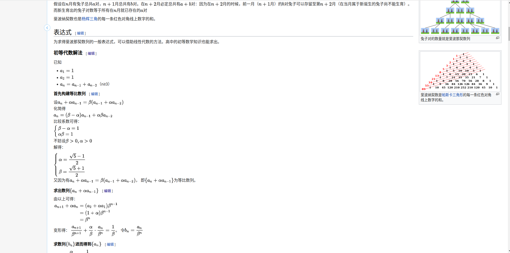

通过标题的等级来区分的办法并行不通。比如 [堆栈](https://zh.wikipedia.org/wiki/%E5%A0%86%E6%A0%88) 的页面中，h4 依旧是作为一个独立的问题存在的。此时似乎陷入了僵局。但当我们对比 [斐波那契数](https://zh.wikipedia.org/wiki/%E6%96%90%E6%B3%A2%E9%82%A3%E5%A5%91%E6%95%B0) 和  [堆栈](https://zh.wikipedia.org/wiki/%E5%A0%86%E6%A0%88) 的页面时，或许会观察到，它们的最上方的`目录`的显示似乎有区别。斐波那契数的目录到 `初等代数解法` 后就是最后一级了，并没有包含 h4 的标题，而堆栈的目录中则是也列出了那些 h4 标题。此时，便自然能得出根据目录来寻找问题的想法。而在控制台模式中，仔细观察后，会发现目录框可以通过 `div[@id='toc']`获得。而在堆栈的页面中，它的上一级是 `div[@class="mw-parser-output"]`，但在斐波那契数的页面中，二者之间还夹了一个 `div[@class="toclimit-3"]`。根据字面意思，有理由怀疑这个标签是用来限制目录大小的。而将其中的 `3` 改成 `4` 后，果然本来没有显示的 h4 标题也显示在目录中了。至此，通过这个标签的有无和其中的数字，我们便可以获得目录中的所有关键词，也就是一个问题的最小单位。


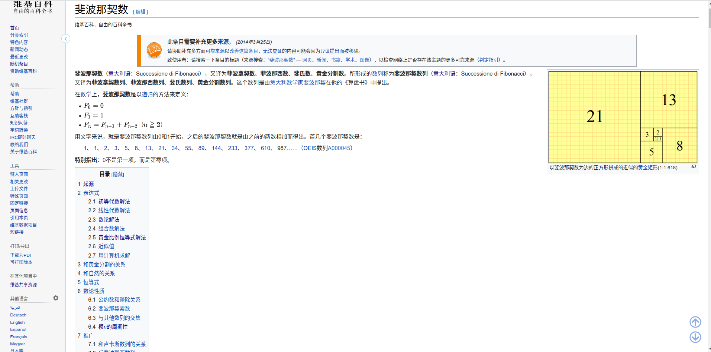

#### 没有目录

在 [编辑距离](https://zh.wikipedia.org/wiki/%E7%B7%A8%E8%BC%AF%E8%B7%9D%E9%9B%A2) 页面中，压根没有目录。这时就要使用最开始的方法直接把所有标题爬下来处理了。


所以最终，在 [`wikipedia.py`](https://github.com/zsq259/PPCA_codemate/blob/main/crawler/wikipedia/wikipedia.py) 中，实现了：

- 在搜索框中搜索关键词。

- 若不能直接跳转具体词条页面，则选取搜索结果的第一条跳转。

- 若有目录，则按照目录显示的各级标题作为所有问题（有些标题并未显示在目录中）；否则直接将所有标题作为问题。

- 将所有问题（各级标题）下对应的文字进行爬取，并拼接为答案组成问答对。

- 每个问题将会爬取当前标题与下一个同级的标题或页面结尾之间的所有文字。

### stackoverflow

与 CSDN 没有太大区别，但是有人机验证和请求太多封 ip 的反爬虫机制。

人工进行人机验证，在接下来的 5min 内网站不会跳转人机验证页面，在这段时间利用爬虫爬取。

[`src.py`](crawler/stackoverflow/src.py) 中实现了在搜索关键词后自动翻页并爬取所有通往具体问答页面的链接。

[`so_spider`](crawler/stackoverflow/so_spider) 文件夹下则是利用 `scrapy` 框架，对所有具体问答页面进行爬取。

如果需要提高爬虫速度的话，需要建立 ip 池解决请求太多被封 ip 的问题。但因为没有足够多的 ip 所以没能实现。（网上获取的免费 ip 不稳定，很容易失效）

## 分类器部分

### 第二周

主要基于机器学习库 `sklearn` 训练模型对测试集进行分类。

使用 `jieba` 进行分词。

采取了若干种不同的模型组合尝试。

向量化模型的选择：

- `TfidfVectorizer`

- `CountVectorizer`

- `Word2Vec`

分类器的算法实现的选择：

- `RandomForestClassifier`（随机森林）

- `MultinomialNB`（多项式朴素贝叶斯）

- `ComplementNB`（补充朴素贝叶斯）

在 [`sklearn_test.py`](https://github.com/zsq259/PPCA_codemate/blob/main/classifier/sklearn_test.py) 中实现了传入 向量化 和 训练模型 的对象即可运行的函数封装，并通过`multiprocessing`使用**多进程**实现同时运行多种模型和参数组合。

由于 `Word2Vec` 使用的对象接口特殊, 所以 [`word2vec_RF.py`](https://github.com/zsq259/PPCA_codemate/blob/main/classifier/word2vec_RF.py) 实现了 `Word2Vec` 与 `RandomForestClassifier` 的组合。

下表显示了训练的数据（训练集和测试集以 9:1 划分）：

| 编号 | 数据                                 | 模型                                                         | 训练集预测准确率   | 测试集预测准确率   |
| ---- | ------------------------------------ | ------------------------------------------------------------ | ------------------ | ------------------ |
| 1    | basic                                | TfidfVectorizer(), RandomForestClassifier()                  | 0.9947319491788038 | 0.8345724907063197 |
| 2    | basic                                | TfidfVectorizer(), RandomForestClassifier(n_estimators=155, random_state=43) | 0.9947319491788038 | 0.8392193308550185 |
| 3    | basic                                | CountVectorizer(), MultinomialNB(alpha = 0.1)                | 0.8564197913438695 | 0.7379182156133829 |
| 4    | basic                                | CountVectorizer(), ComplementNB(alpha = 0.1)                 | 0.8562132011155872 | 0.7379182156133829 |
| 5    | basic                                | Word2Vec(lines, vector_size = 20, window = 5 , min_count = 3, epochs=7, negative=10, sg=1), RandomForestClassifier(n_estimators = 155, random_state = 43) | 0.9947319491788038 | 0.7964684014869888 |
| 6    | basic+CSDN精华                       | TfidfVectorizer(), RandomForestClassifier()                  | 0.9957112801424178 | 0.8631732168850073 |
| 7    | basic+CSDN精华                       | TfidfVectorizer(), RandomForestClassifier(n_estimators=155, random_state=43) | 0.9957112801424178 | 0.8653566229985444 |
| 8    | basic+CSDN精华                       | CountVectorizer(), MultinomialNB(alpha = 0.1)                | 0.8528078977180774 | 0.7561863173216885 |
| 9    | basic+CSDN精华                       | CountVectorizer(), ComplementNB(alpha = 0.1)                 | 0.8540216863570157 | 0.754730713245997  |
| 10   | basic+CSDN精华                       | Word2Vec(lines, vector_size = 20, window = 5 , min_count = 3, epochs=7, negative=10, sg=1), RandomForestClassifier(n_estimators = 155, random_state = 43) | 0.9957112801424178 | 0.8377001455604076 |
| 11   | basic+CSDN精华（代码用 ```\n 包围）  | TfidfVectorizer(), RandomForestClassifier()                  | 0.9957112801424178 | 0.8602620087336245 |
| 12   | basic+CSDN精华（代码用 ```\n 包围）  | TfidfVectorizer(), RandomForestClassifier(n_estimators=155, random_state=43) | 0.9957112801424178 | 0.8609898107714702 |
| 13   | basic+CSDN精华（代码用 ```\n 包围）  | CountVectorizer(), MultinomialNB(alpha = 0.1)                | 0.8510276743809678 | 0.74745269286754   |
| 14   | basic+CSDN精华（代码用 ```\n 包围）  | CountVectorizer(), ComplementNB(alpha = 0.1)                 | 0.853050655445865  | 0.74745269286754   |
| 15   | basic+CSDN精华（代码用 ```\n 包围）  | Word2Vec(lines, vector_size = 20, window = 5 , min_count = 3, epochs=7, negative=10, sg=1), RandomForestClassifier(n_estimators = 155, random_state = 43) | 0.9957921993850137 | 0.8304221251819505 |
| 16   | basic+CSDN精华（代码用 [code] 包围） | TfidfVectorizer(), RandomForestClassifier()                  | 0.9957112801424178 | 0.8566229985443959 |
| 17   | basic+CSDN精华（代码用 [code] 包围） | TfidfVectorizer(), RandomForestClassifier(n_estimators=155, random_state=43) | 0.9957112801424178 | 0.8609898107714702 |
| 18   | basic+CSDN精华（代码用 [code] 包围） | CountVectorizer(), MultinomialNB(alpha = 0.1)                | 0.8510276743809678 | 0.74745269286754   |
| 19   | basic+CSDN精华（代码用 [code] 包围） | CountVectorizer(), ComplementNB(alpha = 0.1)                 | 0.853050655445865  | 0.74745269286754   |
| 20   | basic+CSDN精华（代码用 [code] 包围） | Word2Vec(lines, vector_size = 20, window = 5 , min_count = 3, epochs=7, negative=10, sg=1), RandomForestClassifier(n_estimators = 155, random_state = 43) | 0.9957921993850137 | 0.8384279475982532 |

其中 `数据` 一栏的 `basic` 代表下发的已经标记好的之前爬取的 CSDN 和 Wikipedia 的问答。而 CSDN精华则默认为高质量。

可以看出，TfidfVectorizer() 与 RandomForestClassifier() 的组合效果是最好的，而朴素贝叶斯的组合则表现最差。。这或许与我们分类的问答形式有关。所以后续的进一步调参将只对于 TfidfVectorizer() 与 RandomForestClassifier() 进行。

同时可以发现，在加入 CSDN 精华后，准确率上升了不少。但是代码块是否被包围似乎对最终的准确率影响不大。

经过进一步调整 `RandomForestClassifier()` 参数后的数据：

| 编号 | 数据           | 模型                                                         | 训练集预测准确率   | 测试集预测准确率   |
| ---- | -------------- | ------------------------------------------------------------ | ------------------ | ------------------ |
| 21   | basic+CSDN精华 | TfidfVectorizer(), RandomForestClassifier()                  | 0.9957112801424178 | 0.8602620087336245 |
| 22   | basic+CSDN精华 | TfidfVectorizer(), RandomForestClassifier(n_estimators=55)   | 0.9956303608998219 | 0.858806404657933  |
| 23   | basic+CSDN精华 | TfidfVectorizer(), RandomForestClassifier(n_estimators=200)  | 0.9957112801424178 | 0.8573508005822417 |
| 24   | basic+CSDN精华 | TfidfVectorizer(), RandomForestClassifier(n_estimators=155, random_state=43) | 0.9957112801424178 | 0.8609898107714702 |
| 25   | basic+CSDN精华 | TfidfVectorizer(), RandomForestClassifier(n_estimators=155, random_state=47) | 0.9957112801424178 | 0.8580786026200873 |
| 26   | basic+CSDN精华 | TfidfVectorizer(), RandomForestClassifier(n_estimators=155, random_state=97) | 0.9957112801424178 | 0.8566229985443959 |
| 27   | basic+CSDN精华 | TfidfVectorizer(), RandomForestClassifier(n_estimators=155, random_state=127) | 0.9957112801424178 | 0.8580786026200873 |
| 28   | basic+CSDN精华 | TfidfVectorizer(), RandomForestClassifier(n_estimators=155, random_state=23) | 0.9957112801424178 | 0.8624454148471615 |
| 29   | basic+CSDN精华 | TfidfVectorizer(), RandomForestClassifier(n_estimators=155, random_state=59) | 0.9957112801424178 | 0.8573508005822417 |
| 30   | basic+CSDN精华 | TfidfVectorizer(), RandomForestClassifier(n_estimators=155, random_state=71) | 0.9957112801424178 | 0.8624454148471615 |

可以发现随机森林中决策树的数量以及随机数的选取对最终的准确率影响并不大。

之后再尝试调整 `TfidfVectorizer()` 的参数：

| 编号 | 数据           | 模型                                                         | 训练集预测准确率   | 测试集预测准确率   |
| ---- | -------------- | ------------------------------------------------------------ | ------------------ | ------------------ |
| 31   | basic+CSDN精华 | TfidfVectorizer(max_df=0.6), RandomForestClassifier(n_estimators=155, random_state=71) | 0.9957112801424178 | 0.8609898107714702 |
| 32   | basic+CSDN精华 | TfidfVectorizer(token_pattern=r"(?u)\b\w+\b"), RandomForestClassifier(n_estimators=155, random_state=71) | 0.9957112801424178 | 0.8602620087336245 |
| 33   | basic+CSDN精华 | TfidfVectorizer(stop_words = stopwords), RandomForestClassifier(n_estimators=155, random_state=71) | 0.9957112801424178 | 0.8580786026200873 |
| 34   | basic+CSDN精华 | TfidfVectorizer(max_df=0.6, token_pattern=r"(?u)\b\w+\b"), RandomForestClassifier(n_estimators=155, random_state=71) | 0.9957112801424178 | 0.863901018922853  |
| 35   | basic+CSDN精华 | TfidfVectorizer(max_df=0.6, stop_words = stopwords), RandomForestClassifier(n_estimators=155, random_state=71) | 0.9957112801424178 | 0.8631732168850073 |
| 36   | basic+CSDN精华 | TfidfVectorizer(token_pattern=r"(?u)\b\w+\b", stop_words = stopwords), RandomForestClassifier(n_estimators=155, random_state=71) | 0.9957112801424178 | 0.8631732168850073 |
| 37   | basic+CSDN精华 | TfidfVectorizer(max_df=0.6, token_pattern=r"(?u)\b\w+\b", stop_words = stopwords), RandomForestClassifier(n_estimators=155, random_state=71) | 0.9957112801424178 | 0.8668122270742358 |

以下是停用词列表：

```
"的", "了", "和", "呢", "啊", "哦",
"就", "而", "或", "及", "与", "等",
"这", "那", "之", "只", "个",
"是", "在", "很", "有", "我", "你",
"他", "她", "它", "我们", "你们", "他们",
"自己", "什么", "怎么", "为什么", "因为", "所以",
"如何", "可以", "是否", "是否能够", "能否",
"是否可以", "能不能", "可以吗", "能不能够", "能否给出",
"请问", "请教", "请告知", "请帮忙", "请解释",
"请说明", "请指导", "请提供", "请提醒", "请确认",
"请回答", "请说一下", "请描述", "请列举", "请比较",
"请分析", "请解决", "请评价", "请推荐", "请指出",
"请给出", "请阐述", "请讨论", "请注意", "请考虑",
"谢谢","求求","高手","感激不尽","请"
```

可以发现，对 `TfidfVectorizer()` 的参数加以限制，还是能提升预测的准确率的。并且组合参数限制能带来更大的提升。但总体来说，提升幅度也并不是很大。

### 第四周

主要使用 `huggingface` 中的 bert 预训练模型，构建神经网络，进行深度学习。

主要对于以下参数进行调整（已经尝试过的）。

对于每组数据一般进行 100 轮迭代（将训练数据反复喂给模型），但由于算力问题，以及云端平台的不稳定性，有部分数据的轮数少一些，而且由于前期轮次的效果不是很好，所以就没有重新测试。

- 预训练模型的选择

  - `bert-base-chinese`
  - `algolet/bert-large-chinese`
  - `allenai/longformer-base-4096`

- 下游模型中的神经网络层

  - `Model1`由四个全连接层组成。每个全连接层都由线性层和批量归一化层组成，并使用ReLU激活函数进行非线性变换。

    ```
    class Model1(torch.nn.Module):
        def __init__(self):
            super().__init__()
            self.fc1 = torch.nn.Sequential( torch.nn.Linear(768, 1600), torch.nn.BatchNorm1d(1600), torch.nn.ReLU(True))
            self.fc2 = torch.nn.Sequential( torch.nn.Linear(1600, 800), torch.nn.BatchNorm1d(800), torch.nn.ReLU(True))
            self.fc3 = torch.nn.Sequential( torch.nn.Linear(800, 200), torch.nn.BatchNorm1d(200), torch.nn.ReLU(True))
            self.fc4 = torch.nn.Linear(200, 2)
    
        def forward(self, input_ids, attention_mask, token_type_ids):
            input_ids = input_ids.to(device)
            attention_mask = attention_mask.to(device)
            token_type_ids = token_type_ids.to(device)
            with torch.no_grad():
                out = pretrained(input_ids=input_ids,
                        attention_mask=attention_mask,
                        token_type_ids=token_type_ids)
            out = out.last_hidden_state[:, 0]
            out = self.fc1(out)
            out = self.fc2(out)
            out = self.fc3(out)
            out = self.fc4(out)
            out = out.softmax(dim=1)
            return out
    ```

  - `Model2`是多层卷积神经网络。

    ```
    class Model2(torch.nn.Module):
        def __init__(self):
            super().__init__()
            self.fc1 = torch.nn.Sequential( torch.nn.Conv1d(1, 16, kernel_size=3,padding=1),torch.nn.BatchNorm1d(16), torch.nn.ReLU(True) )
            self.fc2 = torch.nn.Sequential( torch.nn.Conv1d(16, 64, kernel_size=3,padding=1),torch.nn.BatchNorm1d(64), torch.nn.ReLU(True) )
            self.fc3 = torch.nn.Sequential( torch.nn.Conv1d(64, 256, kernel_size=3,padding=1),torch.nn.BatchNorm1d(256), torch.nn.ReLU(True) )
            self.fc4 = torch.nn.Sequential( torch.nn.Linear(256*768, 2), torch.nn.BatchNorm1d(2), torch.nn.ReLU(True))
    
        def forward(self, input_ids, attention_mask, token_type_ids):
            input_ids = input_ids.to(device)
            attention_mask = attention_mask.to(device)
            token_type_ids = token_type_ids.to(device)
            with torch.no_grad():
                out = pretrained(input_ids=input_ids,
                                attention_mask=attention_mask,
                                token_type_ids=token_type_ids)
            out = out.last_hidden_state[:, 0]
            out = out.view(out.shape[0],-1,768)
            out = self.fc1(out)
            out = self.fc2(out)
            out = self.fc3(out)
            out = out.view(out.shape[0],-1)
            out = self.fc4(out)
            out = out.softmax(dim=1)
            return out
    ```

- batch_size

  - 16
  - 32

- max_length（预训练模型接受一句话的最大长度）

  - 512
  - 1024（仅`algolet/bert-large-chinese` 可用）
  - 2048（仅`algolet/bert-large-chinese` 可用）

  预训练模型限制了能接受的最大的长度，而我们有不少数据都是超过这个长度的，所以实际上模型接受的只是句子的一部分。而默认情况下，则是从句首截取指定长度。这也是一开始遇到的一个问题。而可能的解决办法有三种：

  - [x] 随机在句子中选取一段。
  - [ ] 使用滑动窗口将句子拆成若干个句子。
  - [x] 调整模型使其能接受更长的句子，或使用其他模型。

- requires_grad（是否梯度回传，即是否修改预训练模型的参数，也就是微调 bert）

  在实验的时候，设置为 `True` 会极大增加所需内存，需减小 batch_size，而在最初几轮迭代中表现

- learning_rate（梯度下降时的学习率）

  - 1e-3
  - 5e-5
  - 5e-6

- weight_decay（减少过拟合的可能，设置过大可能导致欠拟合）

  - 1e-5

以下是目前已经尝试过的参数及其数据（有些还在测试中）：

| 编号 | 数据  | 模型参数(tokenizer, model, batch_size, max_length, requires_grad_op, learning_rate, weight_decay=default, Model1/2) | 测试集预测准确率                 |
| ---- | ----- | ------------------------------------------------------------ | -------------------------------- |
| 1    | basic | "algolet/bert-large-chinese", 32, 512, False, 5e-5, Model1   | 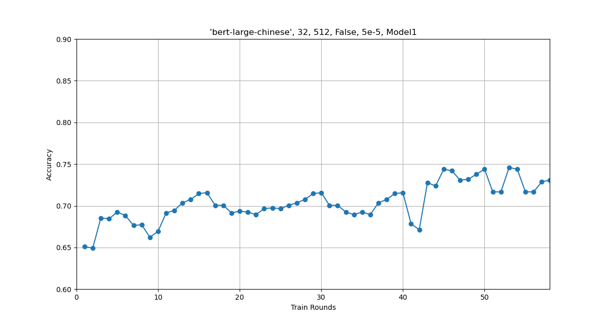  |
| 3    | basic | 'bert-base-chinese', 'allenai/longformer-base-4096', 32, 2048, False, 5e-4, 1e-5, Model1 | 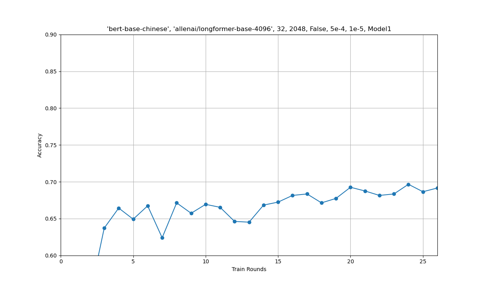  |
| 4    | basic | 'bert-base-chinese', 32, 512, False, 5e-5, Model1            | 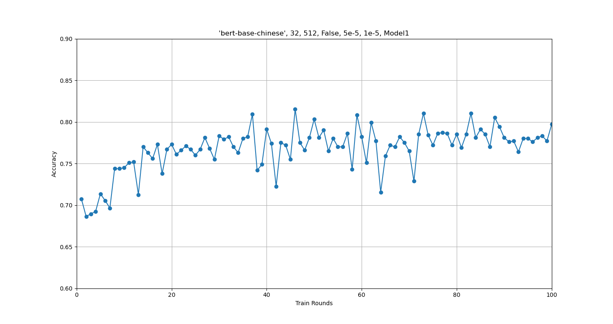 |
| 5    | basic | 'bert-base-chinese', 32, 512, False, 5e-5, 1e-5, Model2      | 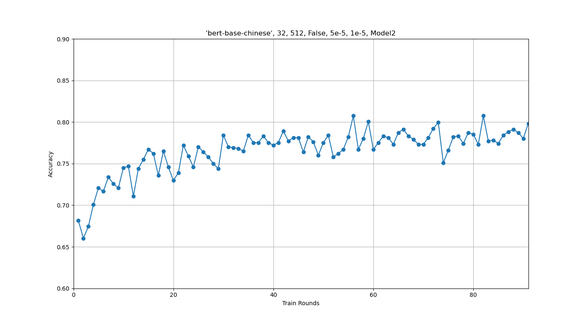 |
| 6    | basic | 'bert-base-chinese', 32, 512, False, 5e-5, Model1            | 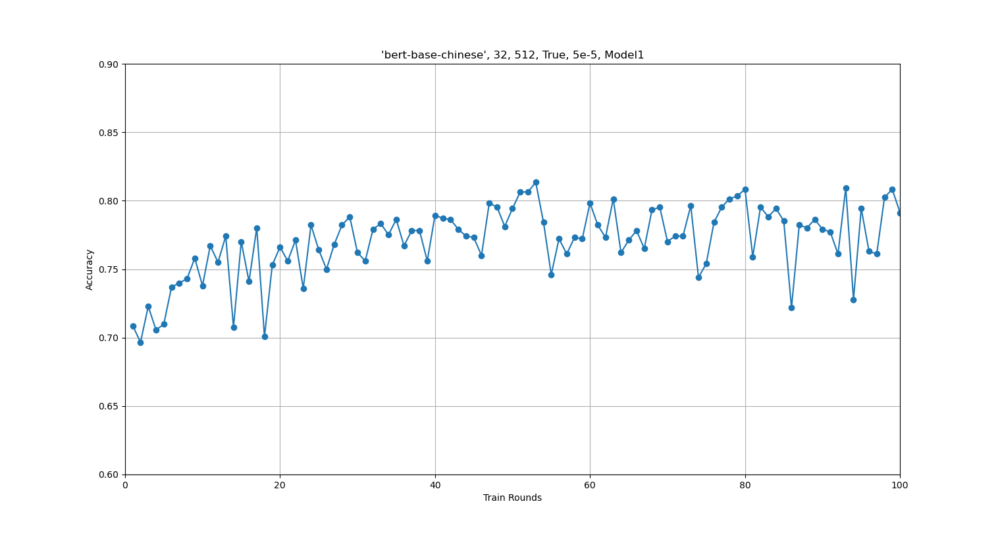  |
| 7    | basic | 'bert-base-chinese', 32, 512, False, 5e-5, 1e-5, Model1      |  |
| 8    | basic | 'bert-base-chinese', 32, 512, False, 1e-3, Model1            | 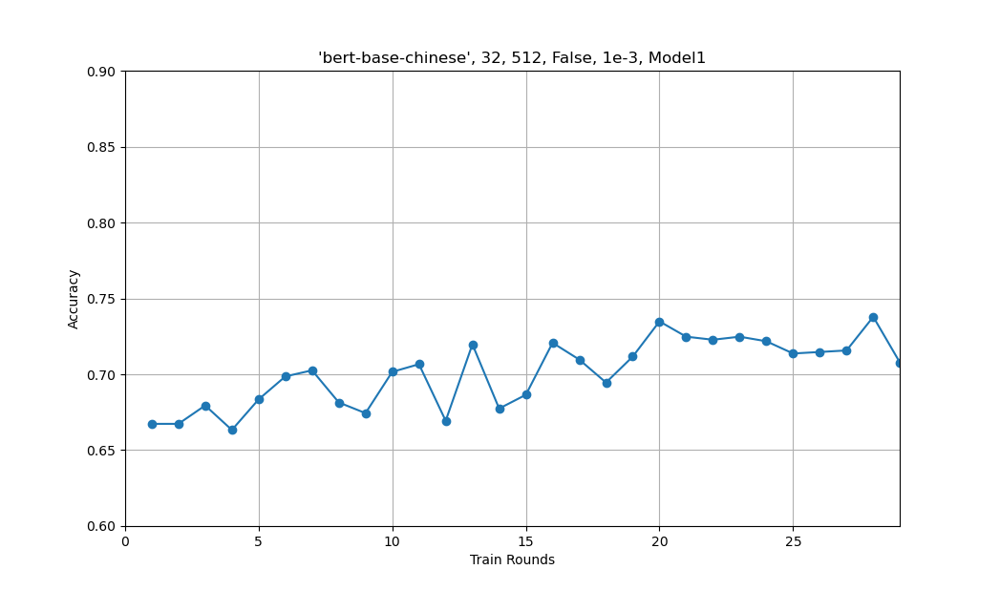  |
| 9    | basic | 'bert-base-chinese', 32, 512, False, 1e-3, 1e-5, Model1      | 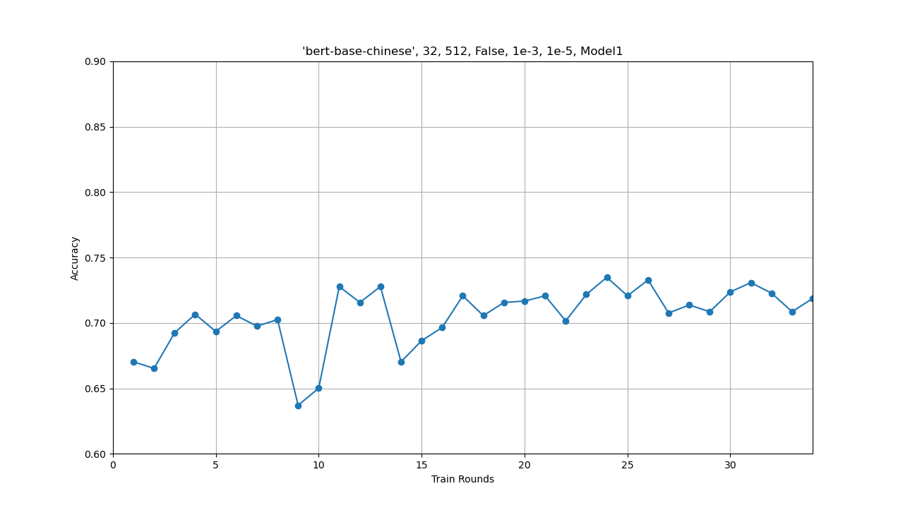 |
| 10   | basic | 'bert-base-chinese', 32, 512, False, 1e-3, Model1            | 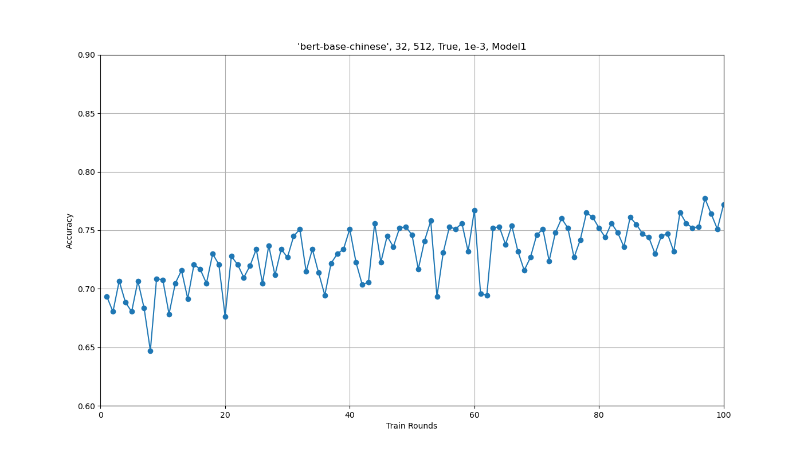  |
| 11   | basic | 'bert-base-chinese', 32, 512, False, 5e-6, 1e-5, Model1      | 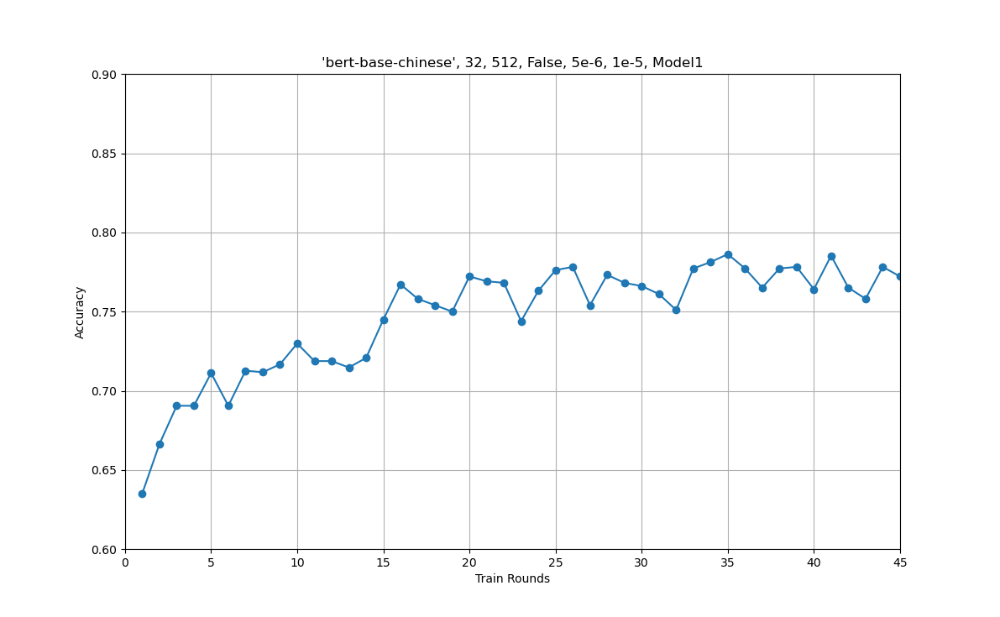 |
| 12   | basic | 'bert-base-chinese', 32, 512, False, 5e-5, 1e-5, Model1, random slice | 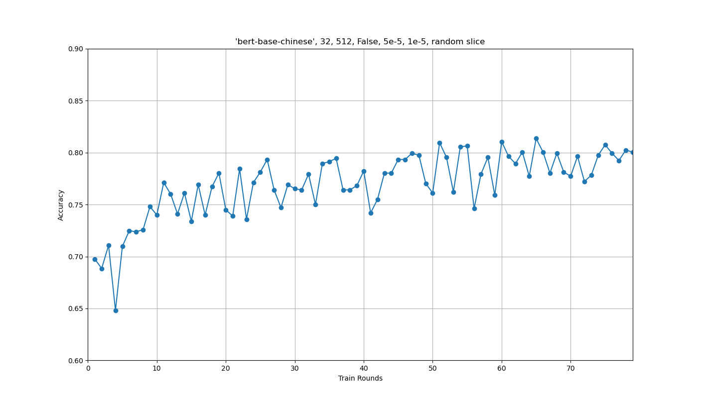 |
| 13   | basic | 'bert-base-chinese', 32, 512, False, 1e-3, 1e-5, Model1, random slice | 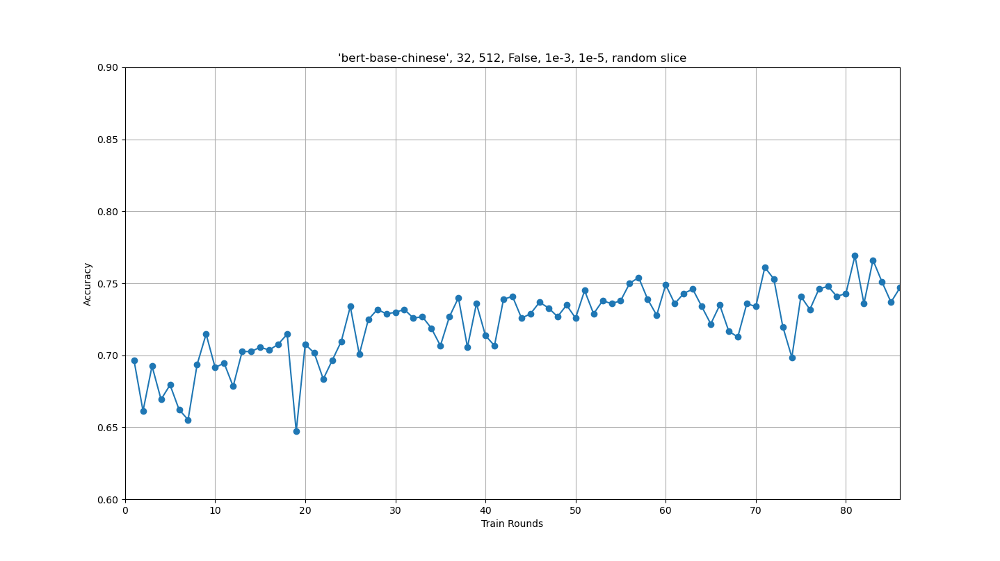 |

令人惊讶的是，最后，使用 `bert-base-chinese`  的效果反而是最好的。这可能也与预训练模型的其他参数有关。可以看到，在数据中，最好的情况下，在 30~40 轮迭代前，准确率在不断上升，而之后则是进入平台期，准确率在 75%~80% 左右波动。但最后还是比第二周的随机森林效果要差。一方面，可能预训练模型还是有所限制；另一方面，由于知识水平有限，我们的下游模型的写法也并不是很成熟，像神经网络的相关知识也很浅薄，对应的库的 api 也不熟悉。再加上算力问题，调参和验证想法需要等待的时间也比较长。

最终，用参数不同的 3 个准确率较高的基于 bert 的模型和 4 个基于随机森林的模型做集成学习的投票，在下发的测试集（相当于验证集）上的准确率在 84.1% 左右，并以此获得筛选后的数据。
